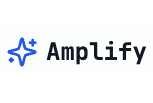
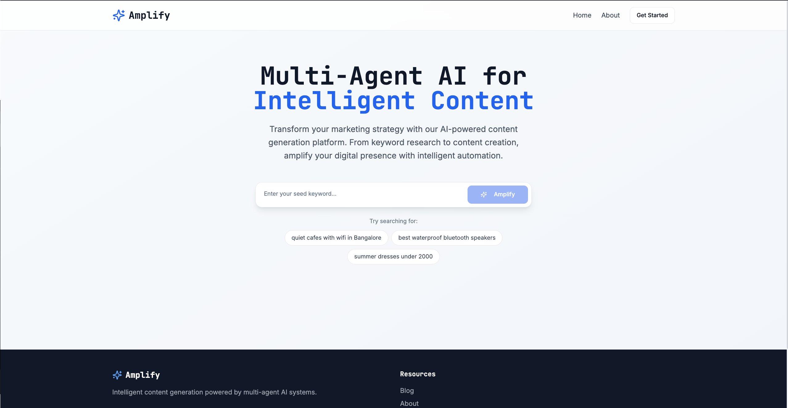
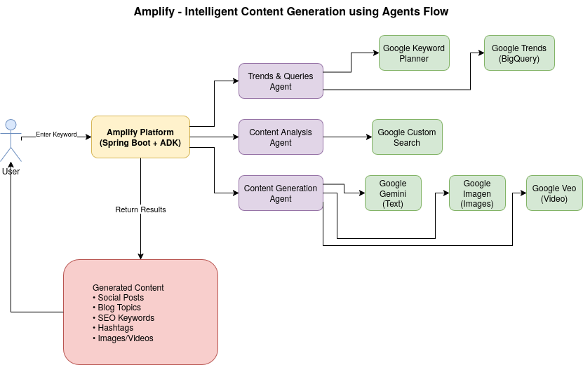
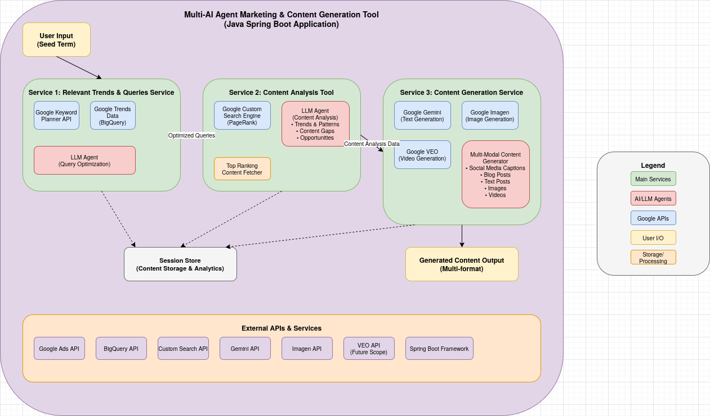

# Amplify

_Your AI-powered content creation team - built for creators, hustlers, and small businesses._

 

## Demo

[](https://v0-marketing-agency-homepage-eight.vercel.app/)



## Welcome!

Thanks for checking out Amplify - our AI-powered content creation toolkit designed to make marketing feel less like a chore and more like a superpower.

## Motivation and Purpose

We saw how small businesses and creators struggle to keep up with content. Marketing tools are either too expensive, too complicated, or just not made for people who hustle solo. So we built Amplify - a tool that combines trends, AI, and automation to help anyone show up online with impact.

## About

Amplify is a multi-agent AI platform that helps creators and businesses generate high-quality content based on trending topics, user input, and real-time market insights.

We built this in under a week during [Agent Development Kit Hackathon with Google Cloud](https://googlecloudmultiagents.devpost.com/), with one foot in production bugs and the other in Google’s LLM ecosystem.

## Features

- Trend-aware keyword suggestions using Google Trends + Keyword Planner
- Content analysis from top-ranking results (Custom Search + LLM)
- Auto-generated captions, blog drafts, hashtags, and visuals
- Modular multi-agent system built with [Google’s Agent Development Kit](https://google.github.io/adk-docs/) 
- Content generation powered by Gemini (text), Imagen (images), and Veo (videos)
- Everything deployed using Google Cloud

## Tech Stack

- Java + Spring Boot
- Google ADK (Agent Development Kit)
- Google Trends + Keyword Planner + Custom Search
- Gemini, Imagen, Veo
- GCP: Cloud Run, BigQuery, Artifact Registry
- Docker
- 
## Flow


## Architecture


## Run Locally

```bash
# Build the app
mvn clean install

# Set credentials (ensure application_default_credentials.json is available)
export GOOGLE_API_KEY=your_key_here

# Run locally
mvn spring-boot:run
```

## Docker

Make sure your `application_default_credentials.json` is in the project root or mounted into the container.

```bash
# Build Docker image
docker build -t amplify-app .

# Run container with credentials
docker run -e GOOGLE_API_KEY=your_key_here -v $(pwd)/application_default_credentials.json:/app/application_default_credentials.json amplify-app
```

## API Testing with curl (Localhost)

### Relevant Keywords API
```bash
curl --location 'http://localhost:8080/query' \
--header 'Content-Type: application/json' \
--data '{ "sessionId": "ABC", "seedTerm": "rasmalai" }'
```


### Search Results Analysis API
```bash
curl --location 'http://localhost:8080/summarize' \
--header 'Content-Type: application/json' \
--data '{ "sessionId": "ABC" }'
```


### Generate Content API
```bash
curl --location 'http://localhost:8080/generate' \
--header 'Content-Type: application/json' \
--data '{ "contentType": "caption", "sessionId": "ABC" }'
```

---

Built for the Google ADK Hackathon. All feedback welcome!
